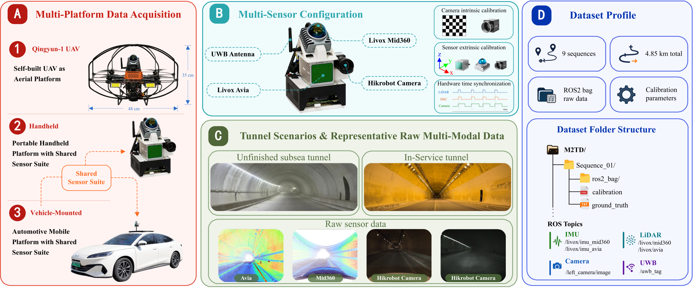

# M2TD: Multi-Sensor and Multi-Platform Tunnel Dataset

## News

- **Under submission**: The M2TD paper is currently under submission.
- Dataset download links will be updated after the release policy is finalized.


---

<p align="center">
  
</p>

<p align="center">
  <b>A Multi-Sensor SLAM Benchmark Dataset for Long Degraded Tunnel Environments</b>
</p>

<p align="center">
  <a href="#overview">Overview</a> •
  <a href="#news">News</a> •
  <a href="#download">Download</a> •
  <a href="#dataset-summary">Dataset Summary</a> •
  <a href="#sensor-suite">Sensor Suite</a> •
  <a href="#data-format">Data Format</a> •
  <a href="#ground-truth">Ground Truth</a> •
  <a href="#citation">Citation</a>
</p>

---

## Overview

**M2TD** is a **Multi-Sensor and Multi-Platform Tunnel Dataset** for benchmarking SLAM algorithms in long degraded tunnel environments. The dataset is designed to evaluate localization and mapping robustness under persistent tunnel-specific degradation, including repetitive structures, weak visual texture, poor illumination, limited geometric diversity, and GNSS denial.

M2TD contains **9 sequences** and **4.85 km** of trajectories collected in one unfinished subsea tunnel in **Qingdao, China**, and five operational traffic tunnels in **Dalian, China**. The data were collected using three acquisition modes:

- **UAV-based acquisition**
- **Handheld acquisition**
- **Vehicle-mounted acquisition**

Each sequence provides ROS2 bag data, calibration files, and reference trajectories generated by **LGAT**, a low-cost ground-truth acquisition framework that tightly couples **LiDAR, IMU, and UWB** measurements in a sequential-update iterated error-state Kalman filter.

M2TD is intended to support research on:

- Robust SLAM in long degraded tunnels
- LiDAR, LiDAR-inertial, and visual-LiDAR-inertial SLAM
- Degeneracy-aware multi-sensor fusion in GNSS-denied environments
- Low-cost reference trajectory acquisition

---

## Key Features

- **Dedicated tunnel benchmark**: long degraded tunnels with repetitive structures, weak texture, poor illumination, limited geometry, and GNSS denial.
- **Multi-platform acquisition**: UAV, handheld, and ground-vehicle sequences.
- **Multi-modal sensing**: Livox LiDARs, built-in IMUs, monocular RGB camera, and UWB ranging.
- **Calibrated and synchronized data**: sensor calibration files are provided; LiDAR, IMU, and camera are hardware-synchronized, while UWB is software-aligned.
- **Low-cost reference trajectories**: LGAT generates reference trajectories using LiDAR, IMU, and a single UWB anchor.
- **Challenging baselines**: representative SLAM methods show scale error, drift, inconsistency, or failure on M2TD.

---

## Download

The full dataset is distributed through external storage because ROS2 bag files are too large for direct GitHub hosting.

> Please replace the placeholders below with the final release links.

| Sequence ID    | Platform       | Location | Length (m) | Size | Download |
| -------------- | -------------- | :--------: | :---------: | ---: | :--------: |
| QD-UAV-01      | UAV            | Qingdao  |        296 | 893M | [Link](https://pan.baidu.com/s/1EiITCcblG6Ieo9OWy4_U_A?pwd=vb2j) |
| QD-UAV-02      | UAV            | Qingdao  |        201 | 903M | [Link](https://pan.baidu.com/s/1xVGEnOOuXMi5ABN9-bQPFw?pwd=a4a5) |
| QD-Handheld-01 | Handheld       | Qingdao  |        783 |  11G | [Link](#) |
| QD-GV-01       | Ground vehicle | Qingdao  |        917 | 8.1G | [Link](#) |
| DL-Handheld-01 | Handheld       | Dalian   |        321 | 4.2G | [Link](https://pan.baidu.com/s/10rvUB2_B-dreGG40BLoaFA?pwd=7qe2) |
| DL-GV-01       | Ground vehicle | Dalian   |        294 | 1.6G | [Link](https://pan.baidu.com/s/1cOXQe4XJ41retTOhxby6dQ?pwd=attk) |
| DL-GV-02       | Ground vehicle | Dalian   |       1105 |  11G | [Link](https://pan.baidu.com/s/1BmPcoc2dl7--Updt5WYDCw?pwd=uckh) |
| DL-GV-03       | Ground vehicle | Dalian   |        513 | 2.2G | [Link](https://pan.baidu.com/s/1lSkF3t7l7bSLTaGTrpGbmw?pwd=8j3p) |
| DL-GV-04       | Ground vehicle | Dalian   |        416 | 2.1G | [Link](https://pan.baidu.com/s/1RKtGQqij898BTMmNeuo90A?pwd=mucc) |

Recommended mirror:

- OneDrive: [Link](#)

---

## Dataset Summary

M2TD contains **9 tunnel sequences** with a total trajectory length of **4.85 km**.

| Sequence ID    | Platform       | Location | Length (m) | Duration (s) | Size | Closed loop |
| -------------- | -------------- | -------- | ---------: | -----------: | ---: | ----------- |
| QD-UAV-01      | UAV            | Qingdao  |        296 |          229 | 893M | Yes         |
| QD-UAV-02      | UAV            | Qingdao  |        201 |          230 | 903M | Yes         |
| QD-Handheld-01 | Handheld       | Qingdao  |        783 |          627 |  11G | Yes         |
| QD-GV-01       | Ground vehicle | Qingdao  |        917 |          457 | 8.1G | Yes         |
| DL-Handheld-01 | Handheld       | Dalian   |        321 |          239 | 4.2G | Yes         |
| DL-GV-01       | Ground vehicle | Dalian   |        294 |           89 | 1.6G | No          |
| DL-GV-02       | Ground vehicle | Dalian   |       1105 |          243 |  11G | No          |
| DL-GV-03       | Ground vehicle | Dalian   |        513 |          123 | 2.2G | No          |
| DL-GV-04       | Ground vehicle | Dalian   |        416 |          116 | 2.1G | No          |

### Sequence naming convention

```text
Location-Platform-Index
```

where:

- `QD` denotes Qingdao.
- `DL` denotes Dalian.
- `UAV` denotes unmanned aerial vehicle acquisition.
- `Handheld` denotes handheld acquisition.
- `GV` denotes ground-vehicle acquisition.

---

## Tunnel Scenarios

M2TD contains two types of tunnel environments.

### Qingdao unfinished subsea tunnel

The Qingdao sequences were collected in an unfinished subsea tunnel without regular traffic infrastructure. This environment contains weak illumination, limited visual texture, and sparse structural cues, making it highly challenging for SLAM systems.

Included sequences:

- `QD-UAV-01`
- `QD-UAV-02`
- `QD-Handheld-01`
- `QD-GV-01`

### Dalian operational traffic tunnels

The Dalian sequences were collected in operational traffic tunnels with standard infrastructure and lighting. These sequences include long straight tunnel segments and one-way traversals, which are useful for evaluating long-range drift accumulation.

Included sequences:

- `DL-Handheld-01`
- `DL-GV-01`
- `DL-GV-02`
- `DL-GV-03`
- `DL-GV-04`

---

## Sensor Suite

| Sensor type | Model                  | Key parameters                                                            | ROS2 frequency |
| ----------- | ---------------------- | ------------------------------------------------------------------------- | -------------: |
| LiDAR       | Livox Mid-360          | FoV: 360° × 59°; range: 40 m                                           |          10 Hz |
| LiDAR       | Livox Avia             | FoV: 70.4° × 77.2°; range: 450 m                                       |          10 Hz |
| IMU         | ICM-40609-D / BMI088   | Built-in 6-axis MEMS IMUs in Livox LiDARs                                 |         200 Hz |
| Camera      | Hikrobot MV-CU013-A0UC | Global-shutter RGB camera; 1280 × 1024 resolution; MVL-HF0628M-6MPE lens |          10 Hz |
| UWB         | Nooploop LinkTrack P-B | Typical ranging accuracy: 0.1 m; maximum ranging distance: 500 m          |          50 Hz |

### Platform-specific configuration

| Platform       | Main sensors                                                       |
| -------------- | ------------------------------------------------------------------ |
| UAV            | Livox Mid-360, built-in IMU, UWB tag                               |
| Handheld       | Livox Mid-360, Livox Avia, built-in IMUs, Hikrobot camera, UWB tag |
| Ground vehicle | Livox Mid-360, Livox Avia, built-in IMUs, Hikrobot camera, UWB tag |

---

## Calibration and Synchronization

M2TD provides calibration files for multi-sensor fusion and benchmark evaluation. The calibration and synchronization procedures follow the tools used in the paper:

- Camera intrinsic calibration: [Kalibr](https://github.com/ethz-asl/kalibr)
- LiDAR-camera extrinsic calibration: [direct_visual_lidar_calibration](https://github.com/koide3/direct_visual_lidar_calibration)
- LiDAR-LiDAR extrinsic calibration: [Livox_automatic_calibration](https://github.com/Livox-SDK/Livox_automatic_calibration)
- LiDAR-camera hardware synchronization: [LIV_handhold](https://github.com/xuankuzcr/LIV_handhold)

The LiDAR, IMU, and camera streams are hardware-synchronized. UWB measurements are aligned to the other sensor streams through software-level temporal alignment.

---

## Data Format

Each released sequence is organized as follows:

```text
M2TD/
  DL-GV-01/
    calibration.yaml
    DL_GV_01/
      DL_GV_01.db3
      metadata.yaml
    ground_truth.txt
  DL-GV-02/
    calibration.yaml
    DL_GV_02/
      DL_GV_02.db3
      metadata.yaml
    ground_truth.txt
  ...
```

For each sequence, the inner folder such as `DL_GV_01/` is the ROS2 bag directory. The `calibration.yaml` file stores the sensor calibration parameters, and `ground_truth.txt` stores the reference trajectory generated by LGAT.

### ROS2 topics

Typical ROS2 topics include:

| Topic                  | Description                 |
| ---------------------- | --------------------------- |
| `/livox/mid360`      | Livox Mid-360 point cloud   |
| `/livox/avia`        | Livox Avia point cloud      |
| `/livox/imu_mid`     | IMU data from Livox Mid-360 |
| `/livox/imu_avia`    | IMU data from Livox Avia    |
| `/left_camera/image` | Monocular RGB image         |
| `/uwb_tag`           | UWB ranging measurement     |

Topic availability varies across platforms. For example, UAV sequences do not include the Livox Avia or camera streams.

---

## Ground Truth

The reference trajectories are generated by **LGAT: Low-Cost Ground-Truth Acquisition for Tunnels**.

LGAT tightly couples LiDAR, IMU, and UWB measurements within a sequential-update iterated error-state Kalman filter. IMU measurements provide high-rate state propagation, LiDAR scans provide local geometric constraints after motion compensation, and UWB measurements provide anchor-relative range and range-gradient constraints.

The framework requires only a **single UWB anchor**, reducing the deployment complexity compared with robotic total stations, motion-capture systems, or high-grade INS systems.

### Ground-truth validation

The generated trajectories were validated using three complementary analyses:

- **Trajectory-length validation** on known-length tunnel sequences
- **Loop-closure validation** on round-trip sequences
- **Point-cloud consistency validation** in revisited tunnel regions

In the paper evaluation, LGAT achieves relative length errors below **0.5%** on known-length tunnels and loop-closure errors below **1 m** on all looped sequences.

---

## Baselines

The following representative SLAM methods are evaluated in the paper:

| Category                                     | Methods                          |
| -------------------------------------------- | -------------------------------- |
| General-purpose SLAM                         | FAST-LIO2, Point-LIO, FAST-LIVO2 |
| Degradation-aware / degenerate-scene methods | IGE-LIO, GenZ-ICP, DA-LIO        |

Baseline configurations and evaluation scripts will be released in this repository when available.

---

## Usage Notes

1. Download the required sequence files from the links above.
2. Extract the sequence folder under the `M2TD/` directory.
3. Check the available ROS2 topics using:

```bash
ros2 bag info <sequence_bag_folder>
```

4. Play a sequence using:

```bash
ros2 bag play <sequence_bag_folder>
```

5. Use the provided calibration and ground-truth files for SLAM evaluation.

---

## Citation

The M2TD paper is currently under submission. The citation information will be updated after the paper is accepted.

If you use M2TD or LGAT before the formal publication, please cite this repository and check this page for the latest citation information.

---

## License

The dataset is released for academic and non-commercial research purposes. Please check the final license file before using the data.
